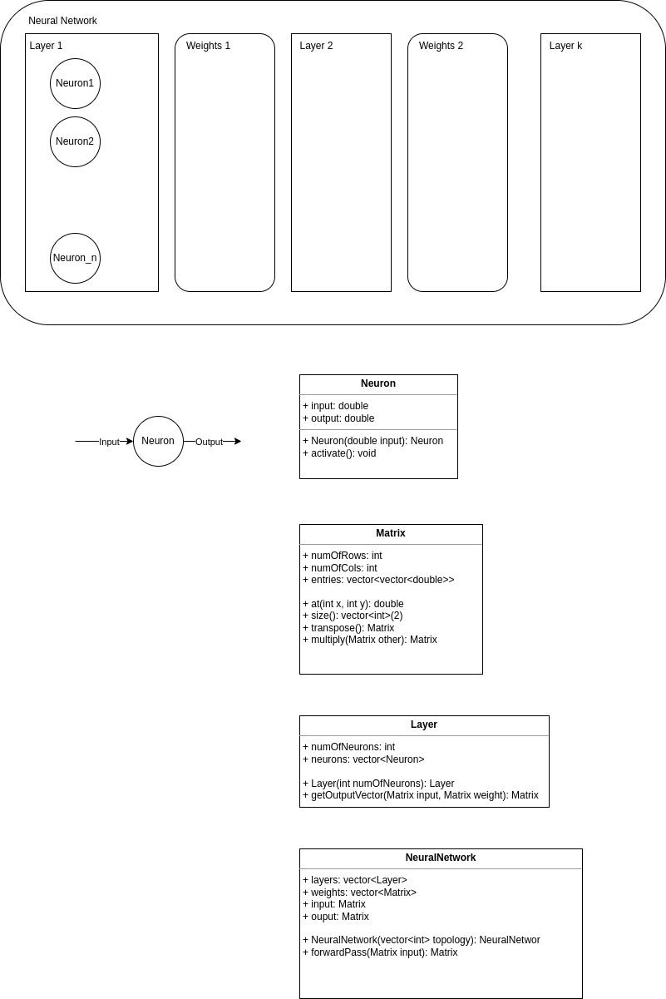

### Neuron
A neuron is the smallest unit of a neural network. It takes an input value and gives an activated output value. The activation can be done using various activation functions. Here, I am taking the plan old fast sigmoid function - $f(x) = \frac{x}{1+|x|}$.

### Matrix
Not an idea of neural network, but a matrix can is a useful tool for storing values required for neural network processing. One of the important thing it stores is the weights of the links connecting the layers. Suppose two consecutive layers have $n$ and $m$ neurons in the same order. In that case, the weight matrix between these layers will be an $n \times m$ matrix. Another way in which we can use a matrix is like a vector of input and outputs produced by a layer. For that we create a $1\times n$ matrix.

### Layer
The next higher unit of a neural network is the layer. A layer consists of a list of neurons which are not connected within themselves but to the next layer in the neural network. In my model, I am thinking of making the layer capable of taking an input matrix (vector) and a weight matrix and produce an output matrix (vector). This is done so that the NeuralNetwork can direct the layer to do the calculations instead of doing it itself.

### NeuralNetwork
Finally, the NeuralNetwork will consist of a list of layers based on the topology provided. For now, I am just implementing the forward pass of the neural network wherein it will take an input vector and produce an output vector. For the first layer, it will just feed the input vector with weight matrix and an $n \times n$ identity matrix. And from the second layer, it will feed the layers with input and corresponding weights matrices.

Let's implement it then. I will not use any high-fi C++ concepts. Probably keep everything in one file itself and then break it down and organize. Off we go!